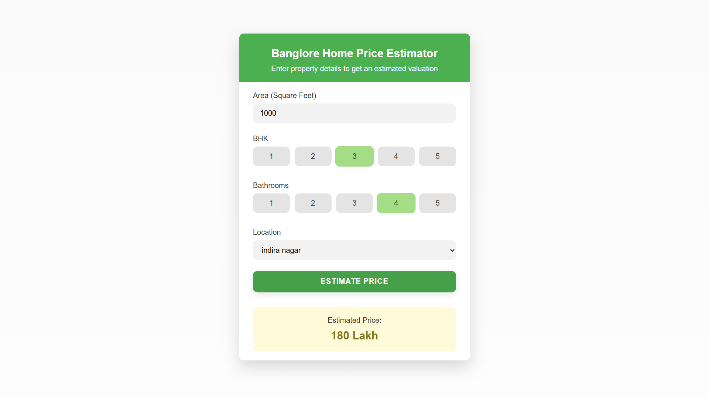

# Banglore Home Prices Prediction



## Overview

This is a end-to-end project predicts real estate prices in Bangalore using machine learning. It features:

- Machine learning model built with scikit-learn and linear regression
- Flask API for serving predictions
- Web interface for real-time price estimation

## Technologies Used

- **Python** - Core programming language
- **NumPy & Pandas** - Data processing and cleaning
- **Matplotlib** - Data visualization
- **scikit-learn** - Machine learning model building
- **Flask** - Backend server
- **HTML/CSS/JavaScript** - Frontend user interface

## Dataset

The model is trained on the [Bangalore House Price Data](https://www.kaggle.com/amitabhajoy/bengaluru-house-price-data) from Kaggle, which contains various features of residential properties in Bangalore.

## Model Building Process

1. **Data Loading & Cleaning**
   - Loaded the dataset into a dataframe
   - Handled NA values and cleaned the data

2. **Feature Engineering**
   - Created BHK (Bedroom, Hall, Kitchen) feature
   - Added price per square feet feature
   - Performed dimensionality reduction on location data

3. **Outlier Removal**
   - Applied business logic (e.g., minimum 300 sqft per bedroom)
   - Used statistical methods (standard deviation, mean)
   - Removed inconsistent properties (e.g., 3 BHK cheaper than 2 BHK)

4. **Model Training**
   - One-hot encoded location features
   - Used linear regression with K-fold cross-validation
   - Performed hyperparameter tuning with GridSearchCV

5. **Model Evaluation & Export**
   - Tested the model with sample properties
   - Exported the model to a pickle file for deployment
   - Saved location and column information for the prediction application

## How to Run

### Prerequisites

- Python 3.x
- Required libraries: numpy, pandas, matplotlib, scikit-learn, flask

### Setup

1. Clone the repository:
   ```
   git clone https://github.com/Omkar-888/Banglore_Home_Prices_Prediction.git
   cd Banglore_Home_Prices_Prediction
   ```

2. (Recommended) Create and activate a virtual environment:
   ```
   # For Windows
   python -m venv venv
   venv\Scripts\activate

   # For macOS/Linux
   python -m venv venv
   source venv/bin/activate
   ```

3. Install dependencies:
   ```
   pip install -r requirements.txt
   ```

4. Start the Flask server:
   ```
   python server/server.py
   ```

5. Open the client/app.html file in your browser to use the application.

## Usage

1. Enter the property details:
   - Area in square feet
   - Number of bedrooms (BHK)
   - Number of bathrooms
   - Location

2. Click "Estimate Price" to get the predicted property value.

## License

This project is open source and available under the [MIT License](LICENSE).

## Acknowledgments

- Dataset provided by Kaggle
- Inspired by real-world real estate pricing challenges


